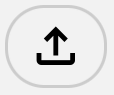

# Welcome to Enscribe!

Firstly we would like to thank you for choosing our product to help with your journey of learning Executable Notations.

We envision Enscribe as a tool that removes the barriers to entry for learning languages with extended unicode support, such as Lambda Calculus, APL, and many more.

## Self-Hosted vs Hosted
Enscribe is publicly hosted by a-team-name software at [https://enscribe.a-team-name.com/login](https://enscribe.containers.uwcs.co.uk/).
However, if you would like to self-host Enscribe, you can do so by following the instructions in the [Self-Hosting Instructions](self-hosting.md) section.

## Making an Account
We, at a-team-name software, host all aspects of our project so you don't have to!

As we are still in a closed-beta we request that you contact our team via joshua.fitzmaurice@warwick.ac.uk to have an account setup for you.

Once an account is setup you will receive an email with your username and password to access the Enscribe platform.

## Logging In
Once you have received your account details, you can log in to the Enscribe platform by going to the login page at [https://enscribe.a-team-name.com/login](https://enscribe.containers.uwcs.co.uk/).

You can enter your username and password in the login form and click the "Log In" button to access your account.

## Creating a New Notebook

Once you have logged in, you will initially be given a new notebook, whenever you want to create another new notebook, you can click the symbol above which you can find in the top left corner of the screen.

## Renaming a Notebook
Simply double click on the notebook name in the top left corner of the screen to rename it. This will allow you to give your notebook a more meaningful name.

## Saving a Notebook

There are 2 different methods to save a notebook. You can either utilise our server-side storage or download the notebook to your local machine.

### Server-Side Storage

The above icon allows you to save a notebook. You will know the notebook gets saved when you get greeted with a "saved" message.

### Downloading a Notebook

The above icon will save a copy of the notebook as a .json file. You can then re-upload this later to continue working on the notebook.

## Opening a Notebook

As with saving a notebook, there are 2 different methods to open a notebook. You can either upload a notebook from your local machine or open a notebook from our server-side storage.

### Uploading a Notebook

The above icon allows you to upload a notebook from your local machine. You can select the .json file you want to upload and click "Open" to load it into Enscribe.

### Opening a Notebook from Server-Side Storage

The above icon allows you to open a notebook from our server-side storage. You can select the notebook you want to open and click "Open" to load it into Enscribe.

## Drawing
The main interaction with Enscribe is through drawing. We don't want to hinder your learning by having to make you learn keyboard shortcuts or complex commands. Instead, we want you to do what comes naturally, drawing. This section aims to take you through the different drawing tools available in Enscribe.

The tool you currently have selected will always be highlighted in green. You can select a different tool by clicking on the icon in the toolbar.

### The Pen

This tool allows you to draw on the canvas. We also offer the ability to change the colour and size of the pen.

### The Eraser

This tool allows you to erase any mistakes you have made. You can also change the size of the eraser. Users should note that the eraser will remove entire lines. Similary to the pen, you can change the size of the eraser.

### The Code Selector

Once you have written some code, you can select it by dragging a code select box around the code you want to select.

### The Pan

This tool allows you to pan around the canvas. After selecting this tool simply click and drag the canvas to move it around. This is useful for when you have a large canvas and want to move around it.

## Code vs Notes
As with all good programs, it is important to document/annotate your code. Enscribe allows you to do this by drawing separate notes on the canvas. All notes drawn will be ignored by our parser.

Whichever of the above is selected is the canvas layer that will be drawn on. By default, code is black ink and notes are blue ink. You can change all the same settings in both code and notes mode.

You can also hide notes by clicking the "Hide Notes" button. This will hide all notes on the canvas. You can show them again by clicking the "Show Notes" button.

## Default Language
Enscribe aims to support a variety of languages. In the top left corner there is a drop down box where you can select the primary language for the notebook.

Note: the primary language of the nontebook will change whenever you select a new language in a code block. However, all code blocks will keep the language they were last set to. This is to allow you to mix and match languages in the same notebook.

## Code Blocks

After selecting the code selector tool and highlighting the code you want in the codeblock, Enscribe will automatically start extracting, parsing, and executing the code. The image above shows the execution of an identity function in Lambda Calculus.

Good code isn't always written on the first try. Enscribe allows you to edit the code in the code block and re-execute it. This is as easy as using the pen and eraser tool to update your code!

**How do I know if a code-block needs re-executing after updating?**
We have implemented a simple visual system indicating whether a code-block is (as we refer to it as) stale or executed. An executed code-block will have a continuous green border around it. A stale code-block will have a dashed green border around it, as seen below.

### Output Toggles
You can choose to hide or show both the transcribed text and the code output using the output toggles on the right hand side of the code block.

### Execute
There is a play button in the bottom left corner of the code block that allows you to execute the code in the code block. This will re-execute the code and update the output.

## Tabs
Sometimes it is nice to separate out work into different sections or tabs. Enscribe allows you to do this!

By clicking the "+" a new tab will be made. To rename tabs, simply double click on the tab name and type in the new name. You can also delete tabs by clicking the "x" on the right hand side of the tab.

## Settings
There are a few extra settings that can be configured in the settings menu. You can access this by clicking the "settings" icon in the top task bar.

### Canvas Background
This setting updates the background of the canvas. By default, the canvas has a square grid background. But you can select from:

- Squares
- Lines
- Dots
- None

### Handwriting Recognition Model - Experimental
This is an advanced setting that allows you to choose the handwriting recognition model used by Enscribe. This is an experimental features used for development testing.

- CNN
- TrOCR
- Shape Context

### Automatic Code Block Execution
This setting allows you to choose whether or not code blocks are automatically executed when they are drawn. By default, this is enabled. However, if you want to draw a lot of code before executing it, you can disable this setting.

### Touch Behaviour
Choose Between

- Pen for drawing, touch for panning
- Pen and touch with the same behavior
