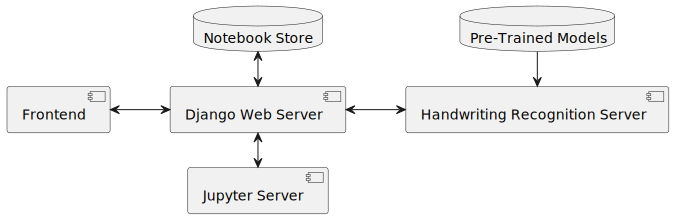

# Microservice Overview

This diagram shows the different components of the Enscribe application and how they interact with each other. The main components are:
- **Enscribe/Django Web Server**: The main application that provides the user interface and handles user interactions.
- **Lambda-Kernculus/Jupyter Server**: The kernel that runs the code and provides the execution environment for the user code.
- **Handwriting Recognition Server**: The server that handles the handwriting recognition and provides the handwriting model.
- **MariaDB**: The database that stores the user data and application data.

Our Django Web Server acts as the main entry point to the application. It handles user authentication, manages the user interface, and communicates with the other components of the application. The Django Web Server is responsible for rendering the HTML pages, handling user interactions, and managing the state of the application.

The Lambda-Kernculus/Jupyter Server is the kernel that runs the code and provides the execution environment for the user code. It is responsible for executing the code and returning the results to the Django Web Server. The connection between the Web Server and the Jupyter Server is established using websockets and REST APIs.

The Handwriting Recognition Server is responsible for handling the handwriting recognition and providing the handwriting model. It communicates with the Django Web Server using 1 endpoint: `translate`.